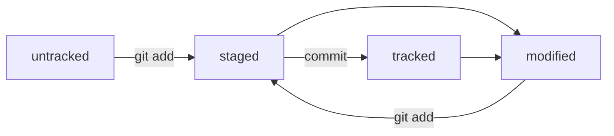

## Шпаргалка по Git  
В этом проекте я стараюсь изложить то, что понял о git из курса "основы git"
----
### 1 Статусы файлов в git

```mermaid
graph LR;
    untracked -- "git add" --> staged
    staged -- "commit" --> tracked
    staged --> modified
    tracked --> modified
    modified -- "git add" --> staged
```